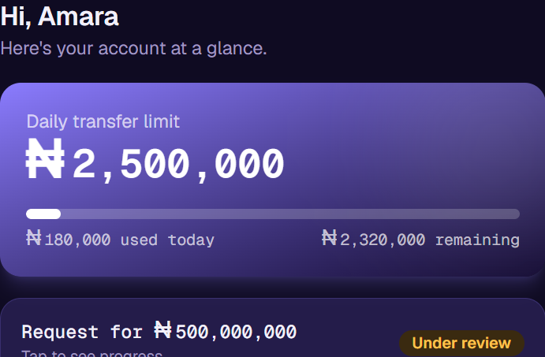
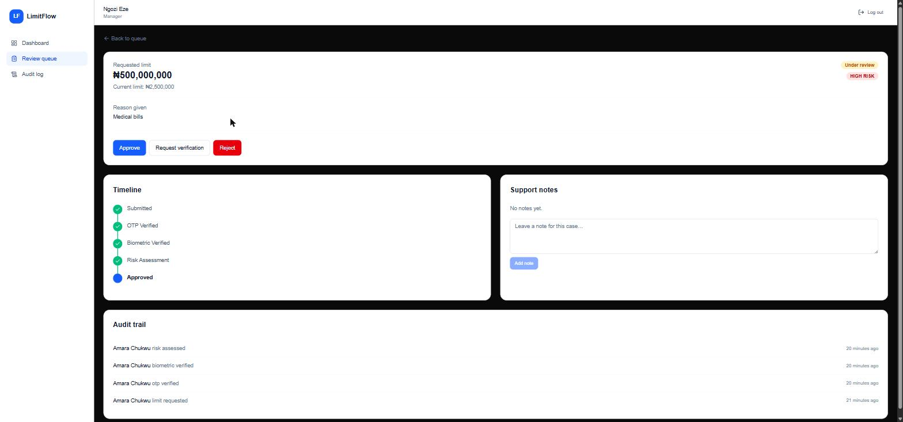
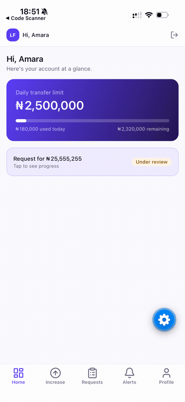

# external-union-bank-ng

> Reimagining what a modern digital banking experience could look like after a frustrating real-world customer support experience with Union Bank Nigeria.

> **Disclaimer:** This is an independent, unofficial software project. It is not affiliated with, endorsed by, or sponsored by Union Bank Nigeria. The experience described below reflects my personal experience, and this repository is intended as an engineering and UX demonstration rather than a representation of the bank's internal systems.

---

# Why this repository exists

I didn't wake up one day wanting to redesign a bank.

This project exists because I experienced what I believe was an unnecessarily difficult customer journey during a situation where time actually mattered.

A family member was in the hospital, and I needed to transfer money from my mother's Union Bank Nigeria account, which she had explicitly given me permission to access for that purpose.

Instead of being able to complete a simple transfer limit increase digitally, what followed was a process that stretched across multiple days, multiple support channels, and multiple verification steps without resolving the issue efficiently.

As a cloud engineer with some software development experience, I couldn't stop thinking:

> **This doesn't have to be this hard.**

So instead of only complaining about the experience, I decided to build the experience I wish existed.

---

# What happened

The account had reached its transfer limit.

Naturally, I opened the mobile app expecting to increase the limit.

Instead, I discovered that the process required details from a debit/credit card that wasn't linked to the account. There was no alternative digital verification flow available.

So I contacted customer support.

## Phone support

I called customer care.

I waited for over 11 minutes without reaching an agent.

## WhatsApp support

I then contacted Union Bank through WhatsApp.

I was placed somewhere around position **300** in the queue.

Over the next several hours, the queue position changed inconsistently and responses remained extremely slow.

After more than 14 hours, I still didn't have a resolution.

## Social media

I reached out through Twitter/X both privately and publicly.

Eventually an account manager contacted me.

At that point I thought the issue would finally be resolved.

Instead, I was informed that because I wasn't the account owner, they couldn't proceed—even though my mother had explicitly authorized me to help her and had provided all necessary information.

## The work schedule problem

My mother works until around 6:00 PM.

Most bank branches close before then.

Taking time off work simply to complete an account maintenance request shouldn't be the only practical option in a digital banking era.

Eventually she had to take a day off work.

## Video verification

She completed a video verification call.

Even after successfully completing identity verification, the process still wasn't finished.

She was then told another department would contact her and send a PDF form.

That form requested information the bank already possessed and that was already visible inside the banking application.

The completed form was returned.

At the time this project was started, the request was still pending.

---

# Why this frustrated me

None of the individual steps seemed unreasonable in isolation.

Together, however, they created a customer journey that felt fragmented, repetitive, and unnecessarily manual.

Identity was verified.

Then more verification was required.

Information already held by the bank had to be submitted again.

Support existed across multiple channels, yet none of them appeared capable of resolving the request from start to finish.

The technology exists to make this dramatically simpler.

I've experienced banking systems in Spain where many sensitive account changes can be completed securely within minutes using combinations of:

* Biometric authentication
* One-time passwords (OTP)
* In-app approvals
* Digital signatures
* Push notifications
* Strong customer authentication

That contrast inspired this project.

---

# The goal

This repository is **not** about reverse engineering Union Bank Nigeria's systems.

It is **not** about exposing proprietary information.

It is **not** about attacking individuals.

Its purpose is to demonstrate how software, good UX, and thoughtful system design can dramatically improve the customer experience.

I want to answer one question:

> **If I were building this banking experience today, how would I design it?**

---


# What this project demonstrates

In-app transfer limit management, secure biometric approvals, OTP-based verification,
intelligent risk-based routing, case tracking with real-time status updates, unified
support, and clear audit trails — built as four working applications, not mockups:

* **[LimitFlow customer portal](apps/customer-portal)** (Next.js) — the primary product. A
  customer requests a transfer-limit increase through a five-step flow (choose limit → reason →
  review → OTP → biometric) and either gets an instant decision or a tracked status while
  it's reviewed.
* **[LimitFlow mobile](apps/mobile)** (Expo / React Native) — the same customer journey on a
  phone, with the two things a browser demo can't fake: a real Face ID/fingerprint prompt for
  biometric verification, and real push notifications for OTP codes and status updates.
* **[LimitFlow backend](apps/backend-api)** (Spring Boot) — Clean Architecture, JWT auth, a
  strategy-pattern risk engine, and full audit logging behind a REST API.
* **[LimitFlow employee portal](apps/employee-portal)** (Next.js) — what a support agent or
  manager sees when the risk engine routes a request to manual review.

---

# Screenshots

<table>
<tr>
<td align="center" width="33%">
<b>Customer — dashboard</b><br/>

</td>
<td align="center" width="33%">
<b>Manager — review queue</b><br/>

</td>
<td align="center" width="33%">
<b>Mobile — increase-limit flow</b><br/>

</td>
</tr>
</table>

---

# Current Experience vs Proposed Experience

| Current Experience        | Proposed Experience                    |
| ------------------------- | -------------------------------------- |
| Reach transfer limit      | Tap "Increase Limit"                   |
| Call customer support     | Authenticate with biometrics           |
| Wait in long queues       | Instant identity verification          |
| Multiple support channels | Single guided workflow                 |
| Video verification        | In-app verification where appropriate  |
| PDF forms                 | Pre-filled digital forms               |
| Manual processing         | Automated approval where policy allows |
| No visibility             | Real-time progress tracking            |

---

# Try it

## Everything, via Docker

```bash
cd docker
docker compose up --build
```

- Backend API: http://localhost:8080 (Swagger UI at `/swagger-ui.html`)
- Customer portal: http://localhost:3001
- Employee portal: http://localhost:3000

Demo accounts (password `Password123!` for all three):

| Role | Email |
|---|---|
| Customer | `customer@limitflow.demo` |
| Support agent | `support@limitflow.demo` |
| Manager | `manager@limitflow.demo` |

## Mobile, via Expo Go

The mobile app isn't part of the Docker stack — it needs a live Metro dev server and a real
phone or simulator, not a container. With the backend running (`docker compose up postgres
backend-api` from above):

```bash
cd apps/mobile
EXPO_PUBLIC_API_BASE_URL=http://<this-machine's-LAN-IP>:8080/api npx expo start
```

Open the result in Expo Go on a phone on the same Wi-Fi network (same demo customer account
as above). See [apps/mobile](apps/mobile) for details.

The seeded customer starts at a ₦200,000 daily limit with ₦180,000 used today, and already
has a ₦500,000 request sitting in the support queue — log in as the customer to see its
status, or as support/manager to review it.

---

# Repository structure

```
external-union-bank-ng/
├── apps/
│   ├── customer-portal/     Next.js — the customer-facing app (primary product)
│   ├── backend-api/         Spring Boot — REST API, risk engine, audit log
│   └── employee-portal/     Next.js — support/manager review console
├── docs/
│   ├── architecture/        System diagram, Clean Architecture per app, why a monorepo
│   ├── system-design/       Risk engine rules, the request state machine
│   ├── api/                 Endpoint reference (mirrors the backend's Swagger UI)
│   └── ux/                  The customer and staff journeys, mapped step by step
├── docker/
│   └── docker-compose.yml   postgres + backend-api + employee-portal + customer-portal
└── README.md                 you are here
```

Each app has its own README with setup details, screens/pages, and what's deliberately
mocked or out of scope. `docs/` is where the cross-app decisions live — why the monorepo,
why the risk engine is synchronous, what the state machine looks like end to end.

---

# What's intentionally out of scope

This is a demonstration of one customer journey, not a banking platform. No loans, cards,
investments, statements, or general-purpose transfers — see each app's README for
what else was deliberately left out (refresh tokens, real SMS/push delivery, real
biometric hardware integration, delegated/shared account access — the "I'm not the account
owner" dead end from the story above is a real, harder problem this demo doesn't attempt to
solve). None of these are missing by oversight; each is a scope decision made to keep the
one journey this project demonstrates sharp rather than build a shallow version of an
entire bank.

---

# Who this project is for

* Software engineers
* Product designers
* UX researchers
* Digital banking teams
* Anyone interested in improving customer experiences through technology

---

# Contributions

Constructive feedback and contributions are welcome.

If you've experienced similar friction with digital banking regardless of the institution I would love to hear your ideas for building better systems.

---

# Final Thoughts

This repository was born out of frustration.

But frustration alone doesn't improve software.

Building better software does.

If this project sparks conversations about modernizing digital banking, simplifying customer journeys, or reducing unnecessary friction, then it has achieved its purpose.
